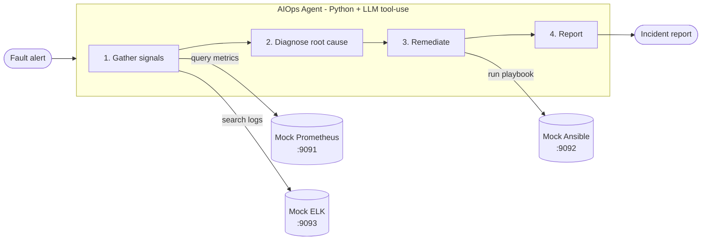

# AutoSRE

> Autonomous LLM-powered Site Reliability Engineer. Feed it a production alert; it pulls metrics and logs, diagnoses the root cause, runs the fix, and writes the incident report.


**[Website](https://canyang25.github.io/AutoSRE/)**

Reference implementation of a closed-loop AIOps agent. A fault alert fires; the agent investigates like an on-call SRE: check dashboards, read logs, form a hypothesis, apply a fix, verify. Self-contained Python tool-use loop, works with any major LLM provider. Observability backends (Prometheus, ELK, Ansible) are lightweight mocks so the whole thing runs on a laptop.

## How it works



1. **Gather signals** - query time-series metrics (Prometheus) and error logs (ELK)
2. **Diagnose** - the LLM correlates signals into a root-cause hypothesis
3. **Remediate** - pick and execute the matching Ansible playbook
4. **Verify and report** - confirm recovery, emit a structured incident report

## Scenarios

| Scenario | Service | Symptom | Root cause | Remediation |
| --------- | ----------------- | ------------------------------------ | ----------------------------------- | ----------------------- |
| `db` | order-service | API latency 200ms to 1.5s | DB connection pool misconfigured | `restore_db_pool.yml` |
| `disk` | file-service | `/data` partition at 98% | Disk space exhausted | `clean_disk_space.yml` |
| `network` | payment-service | Rising payment failure rate | Network partition | `restart_service.yml` |
| `oom` | cache-service | OOM kills / restart loop | Memory leak causing OOM kills | `restart_oom_service.yml` |

## Quickstart

### 1. Install

```bash
git clone https://github.com/canyang25/AutoSRE.git
cd AutoSRE
pip install -r requirements.txt
```

### 2. Add your API key

```bash
cp .env.example .env
# Open .env and set one provider key
```

| Provider | Cost | Key |
| -------------- | ----------------- | -------------------------------------------------------- |
| **Groq** | Free, no card | `GROQ_API_KEY=gsk_...` |
| **Gemini** | Free tier | `GEMINI_API_KEY=...` |
| **Ollama** | Free, fully local | `LLM_PROVIDER=ollama` |
| Anthropic | Paid | `ANTHROPIC_API_KEY=sk-ant-...` |
| OpenAI | Paid | `OPENAI_API_KEY=sk-...` |

Your key stays local. `.env` is git-ignored and never committed.

### 3. Start mock backends

```bash
./start_services.sh
# Prometheus :9091  |  Ansible :9092  |  ELK :9093
```

### 4. Run the agent

```bash
python agent.py db        # DB pool exhaustion
python agent.py disk      # Disk full
python agent.py network   # Network partition
python agent.py --list    # List all scenarios

# No API key? Run offline:
python agent.py db --simulate
```

## Production features

### Webhook server

Receive Alertmanager webhooks and run incidents serially:

```bash
python server.py
# POST /webhook/alertmanager
# GET  /health
# GET  /incidents
```

### Approval gate

Gate remediation with `AUTOSRE_APPROVAL_MODE`:

| Mode | Behavior |
| ---- | -------- |
| `auto` | Approve all playbooks (default) |
| `prompt` | Ask an operator on stdin before `run_playbook` |
| `webhook` | POST to `AUTOSRE_APPROVAL_WEBHOOK_URL`; require `{"approved": true}` |

### LLM fallback chain

Set `LLM_FALLBACK_CHAIN=groq,openai,anthropic` to try providers in order when one fails.

### Incident history

Every agent run (including failures/timeouts) is persisted in SQLite (`autosre.db` by default). Query via `GET /incidents`, `GET /incidents/{id}`, or `autosre.store.get_history()`.

### Real backends

Set `AUTOSRE_BACKEND_MODE=real` plus `AUTOSRE_HTTP_AUTHORIZATION` to talk to Prometheus (PromQL), Elasticsearch (Query DSL), and AWX (`/api/v2/job_templates/{id}/launch/`). Keep `mock` for the laptop Flask services. See `.env.example`.

### Webhook auth

When `AUTOSRE_WEBHOOK_TOKEN` is set, Alertmanager must send `Authorization: Bearer <token>`.

### Rollback safety net

If `AUTOSRE_ROLLBACK_PLAYBOOK` is set, AutoSRE re-checks a key metric after remediation and independently executes the rollback playbook when the service still looks unhealthy.

## Repo structure

```
.
├── agent.py              # Thin CLI → autosre.agent
├── server.py             # Thin CLI → autosre.webhook (FastAPI)
├── autosre/
│   ├── agent.py          # LLM tool-use loop, fallback, rollback
│   ├── tools.py          # Thin tool dispatch + policy/approval gates
│   ├── backends/         # mock|real Prometheus, ES, AWX adapters
│   ├── policy.py         # Blast-radius / allowlist gate
│   ├── audit.py          # Append-only JSONL audit log
│   ├── approval.py       # Remediation approval gate
│   ├── retry.py          # HTTP / LLM retries
│   ├── logging.py        # JSON logs + trace IDs
│   ├── store.py          # SQLite incident history
│   ├── webhook.py        # Alertmanager webhook API
│   ├── metrics_self.py   # In-process agent counters
│   └── config.py         # Env-driven configuration
├── scenarios.py/.json    # Fault scenario definitions
├── eval.py               # Evaluation harness (--json, partial scores)
├── trigger_fault.py      # Optional Dify workflow trigger
├── start_services.sh     # Start mock backends (no Docker)
├── deploy.sh             # Start mock backends via Docker
├── tools/                # Mock Prometheus / ELK / Ansible
├── fixtures/             # Canned metrics, logs, playbooks
├── tests/                # Test suite
├── docs/                 # Project website (GitHub Pages)
└── .env.example
```

## Connecting real infrastructure

The mock services use the same API contracts as the real tools. To switch:

1. Set `PROMETHEUS_URL`, `ELK_URL`, and `ANSIBLE_URL` in `.env` to your actual endpoints
2. Add auth headers in the tool wrapper functions in `autosre/tools.py` if needed

The agent reasoning loop is unchanged either way.

## License

[MIT](LICENSE)
