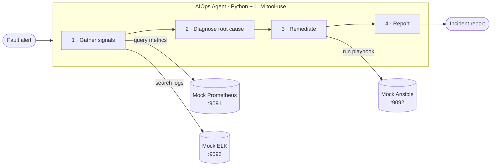

# AutoSRE

> An autonomous, LLM-powered Site Reliability Engineer. Give it a production alert and it pulls the metrics and logs, diagnoses the root cause, runs the fix, and writes the incident report.


This is a reference implementation of a **closed-loop AIOps agent**. A fault alert fires; the agent investigates like an on-call SRE would — check the dashboards, read the logs, form a hypothesis, apply a fix, verify — and hands back a written report. The agent is a self-contained Python tool-use loop that works with any major LLM provider; observability backends (Prometheus, Elasticsearch/ELK, Ansible) are provided as lightweight mocks so the whole thing runs on a laptop.

## How it works



The agent runs a four-step loop:

1. **Gather signals** — query time-series metrics (Prometheus) and error logs (ELK) for the affected service.
2. **Diagnose** — the LLM correlates the signals into a root-cause hypothesis.
3. **Remediate** — pick and execute the matching Ansible playbook (restore DB pool, clean disk, restart service).
4. **Verify & report** — confirm recovery and emit a structured incident report.

## Scenarios

Three faults ship with the demo, each with a known ground-truth root cause so you can check the agent's reasoning:

| Scenario  | Service           | Symptom                              | Root cause                          | Remediation             |
| --------- | ----------------- | ------------------------------------ | ----------------------------------- | ----------------------- |
| `db`      | order-service     | API latency 200ms → 1.5s             | DB connection pool misconfigured    | `restore_db_pool.yml`   |
| `disk`    | file-service      | `/data` partition at 98%             | Disk space exhausted                | `clean_disk_space.yml`  |
| `network` | payment-service   | Rising payment failure rate          | Network partition                   | `restart_service.yml`   |

## Quickstart

### 1. Install dependencies

```bash
pip install -r requirements.txt
```

### 2. Add your API key

```bash
cp .env.example .env
```

Open `.env` and uncomment **one** provider, pasting in your key:

| Backend        | Cost              | What to set in `.env`                                    | Get a key |
| -------------- | ----------------- | -------------------------------------------------------- | --------- |
| **Groq**       | Free (no card)    | `GROQ_API_KEY=gsk_...`                                  | [console.groq.com/keys](https://console.groq.com/keys) |
| **Gemini**     | Free tier         | `GEMINI_API_KEY=...`                                     | [aistudio.google.com/apikey](https://aistudio.google.com/apikey) |
| **Ollama**     | Free, fully local | `LLM_PROVIDER=ollama` (+ [install Ollama](https://ollama.com)) | — |
| Anthropic      | Paid              | `ANTHROPIC_API_KEY=sk-ant-...`                           | [console.anthropic.com](https://console.anthropic.com) |
| OpenAI / other | Paid              | `OPENAI_API_KEY=sk-...` (+ `OPENAI_BASE_URL` if needed) | [platform.openai.com](https://platform.openai.com) |

> **Your key stays local.** The `.env` file is git-ignored and never committed. Only `.env.example` (with placeholder values) is tracked.

### 3. Start the mock backends

**Without Docker** (recommended — just Python):

```bash
./start_services.sh
```

**With Docker** (if you prefer):

```bash
./deploy.sh
```

| Service         | URL                     | Role                         |
| --------------- | ----------------------- | ---------------------------- |
| Mock Prometheus | http://localhost:9091   | Time-series metrics          |
| Mock ELK        | http://localhost:9093   | Log search                   |
| Mock Ansible    | http://localhost:9092   | Playbook execution           |

### 4. Run the agent

```bash
python agent.py db          # database pool exhaustion scenario
python agent.py disk        # disk space full scenario
python agent.py network     # network partition scenario
python agent.py --list      # list all available scenarios
```

The agent calls the mock tools, diagnoses the root cause, runs the matching
playbook, and writes a report to `reports/incident-*.md`.

### 5. (Optional) Preview without any setup

There's an offline simulation that walks through the agent's logic — no servers, no keys:

```bash
python agent.py db --simulate
```

## Repo structure

```
.
├── agent.py              # the agent: LLM tool-use loop over the mock tools
├── trigger_fault.py      # optional: send the alert to a Dify workflow (or --simulate)
├── start_services.sh     # start mock backends locally (no Docker)
├── deploy.sh             # start mock backends via Docker Compose
├── tools/
│   ├── mock_prometheus.py   # metrics API  (:9091)
│   ├── mock_elk.py          # log search API (:9093)
│   └── mock_ansible.py      # playbook runner API (:9092)
├── .env.example          # configuration template — copy to .env and add your key
└── requirements.txt
```

## Tech stack

- **Agent:** Python LLM tool-use loop — backend-agnostic (Groq, Gemini, Ollama, Anthropic, OpenAI-compatible)
- **Tools:** Flask mock services standing in for Prometheus, Elasticsearch/ELK, and Ansible
- **Optional orchestration:** [Dify](https://dify.ai) workflow (via `trigger_fault.py`)

## Connecting real backends

The mock services follow the same API contracts as their real counterparts. To point the agent at real infrastructure:

1. Replace `PROMETHEUS_URL` / `ELK_URL` / `ANSIBLE_URL` in `.env` with your actual service endpoints.
2. If your real APIs require authentication, add the appropriate headers in the tool wrapper functions in `agent.py`.

The agent's reasoning loop is the same either way — it uses the tool outputs to diagnose and remediate.

## Notes

- **Primary path is `agent.py`** — a self-contained loop that needs only an API key and the mock backends. It falls back to an offline walkthrough when no key is set.
- The original Dify Workflow definition (DSL) is **not** included — that hosted instance is gone. `trigger_fault.py` remains for anyone who wants to rebuild a Dify workflow, but it isn't required to run the project.
- The mock services return canned-but-realistic data; they exist to exercise the agent's reasoning, not to be real observability backends.

## License

[MIT](LICENSE)
